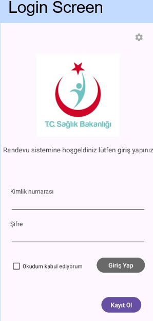
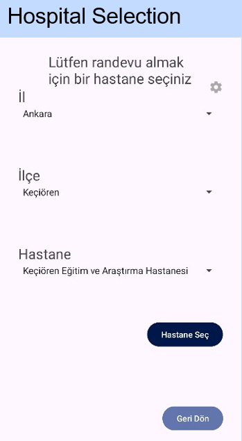
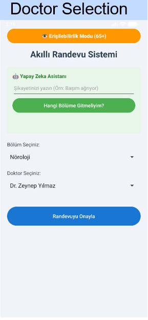
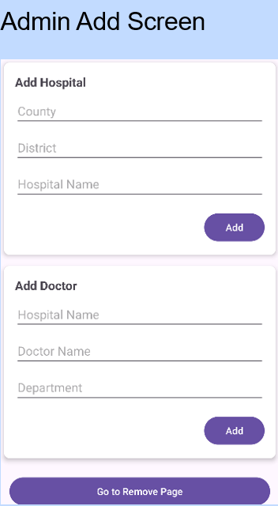
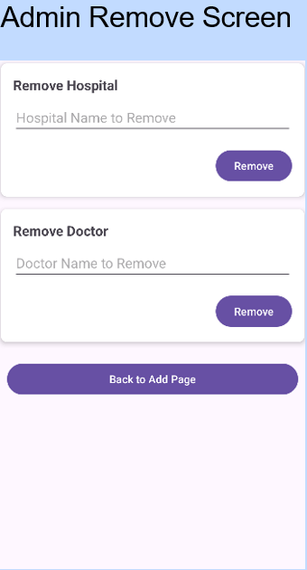

# MHRS Android Hospital Appointment System

This project is an Android-based hospital appointment system inspired by Turkey’s Central Hospital Appointment System (MHRS). It aims to simulate a real-world healthcare booking workflow, allowing users to manage appointments through a mobile application.

## Overview
The application provides a structured system where users can select hospitals, choose departments and doctors, and book available time intervals. It focuses on building a scalable and maintainable mobile system using core software engineering principles.

## Technical Stack
- **Language:** Java
- **Platform:** Android SDK
- **Database:** SQLite (local storage) + Firebase Realtime Database (cloud synchronization)
- **Build System:** Gradle
- **Testing:** JUnit

## Features
- User registration and login system
- Hospital selection
- Department and doctor selection
- Appointment booking with time interval selection
- Appointment state management (availability tracking)
- Admin panel for adding/removing hospitals and doctors (for testing/debugging)

## Architecture & Design
The system is designed with a modular structure including:
- User management module
- Hospital & doctor database structure
- Appointment scheduling system

The database follows a relational design:
- Hospitals contain multiple doctors
- Doctors have multiple available time intervals
- Appointments are linked to users and update availability status

This structure ensures data consistency and scalability.

## Data Management
- **SQLite** is used for local data persistence and offline access
- **Firebase Realtime Database** is integrated for cloud synchronization and data reliability

## Screenshots

  
  
  
  
  

  <i>User Flow: Login → Hospital Selection → Department & Doctor Selection → Appointment Booking</i>

## Testing
Basic unit tests are implemented using JUnit to verify:
- Appointment booking logic
- Department recommendation logic (symptom-based mapping)

Example:
- Input: "başım ağrıyor"  
- Output: "Neurology"  

## Challenges
- Learning Android development from scratch
- Debugging performance issues in Android Studio
- Managing data consistency between local and cloud databases
- Handling appointment availability logic

## Ongoing Development
- Accessibility mode for elderly users (larger fonts, high contrast UI)
- Improved UI/UX design
- Enhanced cloud integration
- Symptom-based department recommendation system

## Future Improvements
- Full authentication and security system
- REST API integration
- More advanced recommendation algorithms
- Nationwide scalability

---

Developed as a Computer Engineering project.
